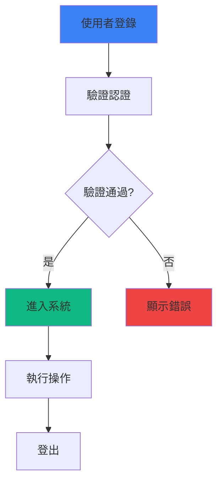

# mermaid-visualizer

Transform text content into professional Mermaid diagrams with automatic syntax error prevention.

# Mermaid Visualizer

## 📌 描述

將文本內容轉換為專業的 Mermaid 圖表，內置語法錯誤預防機制。支援流程圖、循環工作流、比較圖、心智圖、序列圖和狀態轉移圖。

## 🎯 何時使用

- 🔄 將流程和工作流程視覺化
- 🏗️ 呈現系統架構和組件關係
- 📊 創建比較分析圖（A vs B）
- 🧠 從文本生成思維導圖
- 🔗 展示事物之間的因果關係
- 📈 製作順序圖和狀態轉移圖

## 📋 前置要求

- Claude Code CLI
- 基本的 Mermaid 語法理解（此 Skill 會自動處理語法）
- Obsidian（可選，用於預覽）

## 🔄 工作流程

### 步驟 1：分析內容結構
檢查輸入文本，識別主要概念、層級關係和流程順序

### 步驟 2：選擇圖表類型
根據內容特性選擇最適合的 Mermaid 圖表類型

**支援的圖表類型**：
- **Process Flow** - 帶泳道和反饋迴路的流程圖
- **Circular/Cyclic** - 循環工作流
- **Comparison** - A vs B 分析佈局
- **Mindmap** - 分層思維導圖
- **Sequence** - 交互和時序圖
- **State Diagram** - 狀態轉移圖

### 步驟 3：配置佈局和樣式

**佈局方向**：
- `TD`：從上到下（預設）
- `LR`：從左到右
- `RL`：從右到左
- `BT`：從下到上

**詳細程度**：
- `simple` - 基本概念
- `standard` - 一般使用
- `detailed` - 完整資訊
- `presentation` - 展示專用

**樣式選項**：
- `minimal` - 簡潔風格
- `professional` - 專業風格
- `colorful` - 彩色風格
- `academic` - 學術風格

### 步驟 4：生成語法有效的 Mermaid 代碼

**語法錯誤預防規則**：
- ✅ 避免節點標籤中的 Markdown 列表衝突
- ✅ 確保子圖使用正確的 ID 和命名
- ✅ 使用標識符正確引用節點
- ✅ 適當處理特殊字元和換行

### 步驟 5：輸出 Markdown 代碼塊

將生成的 Mermaid 代碼輸出在 markdown 代碼塊中，並附加說明

## 💻 使用語法

```
/mermaid-visualizer [options]
```

### 可用選項

```
--type <diagram-type>        # 指定圖表類型 (auto/flowchart/mindmap/sequence/state)
--direction <direction>       # 佈局方向 (TD/LR/RL/BT)
--detail <level>             # 詳細程度 (simple/standard/detailed/presentation)
--style <style>              # 樣式 (minimal/professional/colorful/academic)
--title <title>              # 圖表標題
--with-legend                # 添加圖例
--with-numbering             # 添加序號
--dry-run                    # 預覽而不實際建立
```

## 📚 使用範例

### 範例 1：基本流程圖

**輸入**：
```
使用者登錄 → 驗證認證 → 進入系統 → 執行操作 → 登出
```

**執行**：
```
/mermaid-visualizer --type flowchart --title "用戶登錄流程"
```

**輸出**：
````markdown

````

### 範例 2：思維導圖

**輸入**：
```
Claude Code
- Skills（自動化工作流）
  - Mermaid Visualizer
  - Excalidraw Diagram
  - Canvas Creator
- Shortcuts（手動命令）
  - /commit
  - /test
  - /build
- Plugins（外部整合）
  - 第三方工具
```

**執行**：
```
/mermaid-visualizer --type mindmap --title "Claude Code 功能"
```

### 範例 3：序列圖

**輸入**：
```
使用者 ->> Web 應用: 發送請求
Web 應用 ->> API 伺服器: 查詢資料
API 伺服器 ->> 資料庫: 執行查詢
資料庫 -->> API 伺服器: 返回資料
API 伺服器 -->> Web 應用: 返回結果
Web 應用 -->> 使用者: 顯示頁面
```

**執行**：
```
/mermaid-visualizer --type sequence --style professional
```

### 範例 4：狀態圖

**輸入**：
```
起始態 → 待機態 → 運行態 → 暫停態 → 停止態
運行態 → 錯誤態 → 恢復態 → 運行態
```

**執行**：
```
/mermaid-visualizer --type state --detail detailed
```

## ✅ 驗證標準

生成的 Mermaid 圖表應滿足：

- ✅ 有效的 Mermaid 語法（無錯誤）
- ✅ 清晰的節點標籤（避免特殊字元衝突）
- ✅ 邏輯正確的流向和連線
- ✅ 適當的佈局和視覺層級
- ✅ 可在 Obsidian 中正確渲染

## 🐛 常見問題

| 問題 | 原因 | 解決方案 |
|------|------|---------|
| **圖表無法渲染** | Mermaid 語法錯誤 | 檢查節點名稱是否包含禁用字元 |
| **節點標籤重疊** | 文本過長 | 縮短標籤或使用 `--detail simple` |
| **連線方向錯誤** | 指定了錯誤的方向 | 重新執行並指定 `--direction` |
| **樣式不符合預期** | 選擇了不適合的樣式 | 嘗試其他 `--style` 選項 |

## 🔗 相關 Skills

- `/excalidraw-diagram` - 手繪風格圖表
- `/obsidian-canvas-creator` - 交互式 Canvas 圖表
- `/format-code` - 代碼格式化

## ⚠️ 限制

- 此 Skill 在複雜圖表（>20 個節點）上可能需要多次調整
- 某些特殊字元可能需要手動轉義
- 極度複雜的嵌套結構可能無法自動優化
- 最適合用於中等複雜度的圖表（5-15 個節點）

## 📝 更新日誌

### v1.0.0 (2026-01-12)
- 初始版本
- 支援 6 種圖表類型
- 內置語法錯誤預防
- 支援 4 種樣式選項
