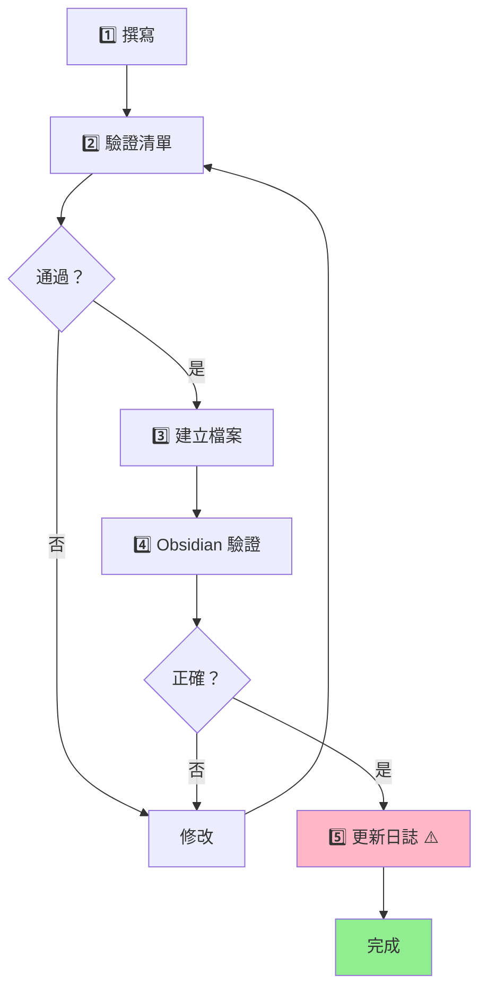

# 發布工作流

將完成的筆記經過驗證後發布到知識庫並提交 Git。

## 何時使用

- 筆記撰寫完成，準備正式發布
- 需要驗證筆記是否符合規範後提交

## 工作流程

## 發布驗證

- [ ] Obsidian 驗證通過（Frontmatter、圖表、連結）
- [ ] 資料夾卡片數 ≤7
- [ ] 檔案編碼 UTF-8
- [ ] ~={orange}**更新日誌** ⚠️ 最容易遺漏！=~

## 注意事項

- 發布後務必更新每日工作日誌（參考 `daily-log-recorder` skill）
